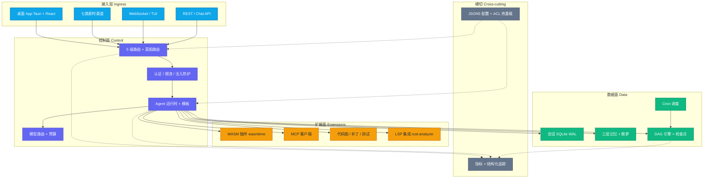

# FastClaw

**English:** A high-performance AI agent orchestration engine in Rust—gateway, routing, memory, DAG workflows, multi-agent collaboration, and safe extensibility. Ships as a single CLI binary **and** a cross-platform Tauri desktop app with an embedded gateway.  
**中文：** 基于 Rust 的高性能 AI Agent 编排引擎——集成网关、路由、记忆、DAG 工作流、多智能体协作与安全扩展。同时提供单二进制 CLI 与内嵌网关的 Tauri 跨平台桌面应用。

## Highlights

> **亮点概览**

- 🖥️ **Desktop app (Tauri 2 + React 19)** — Cross-platform desktop shell embedding the gateway in-process; **zero-config launch** (double-click or `fastclaw app`), system tray, global shortcut (**Ctrl+Shift+Space**), streaming chat with tool-call cards, human-in-the-loop `ask_question`, agent/session/skill management, and first-run onboarding — all sharing config and data with the CLI.  
  *Tauri 2 跨平台桌面应用，内嵌网关进程内启动；双击即用、系统托盘、全局快捷键、流式聊天、ask_question 人机回环、Agent/会话/技能管理、首启引导，与 CLI 共享配置数据。*

- 🌐 **Gateway-ready serving** — Axum HTTP/WebSocket, `/health` / `/ready`, Prometheus on `/metrics` and `/api/v1/metrics`, configurable CORS, **30s graceful shutdown on SIGTERM**, and **SIGHUP-driven config hot reload** alongside file-watch reload.  
  *生产级网关：健康/就绪探针、双指标出口、可配 CORS、SIGTERM 优雅退出约 30s、SIGHUP 与文件监听热重载。*

- 📡 **Seven first-class channels** — Feishu, Telegram, Discord, Slack, WhatsApp, Matrix, and Microsoft Teams as native workspace extensions.  
  *七类通道：飞书、Telegram、Discord、Slack、WhatsApp、Matrix、Microsoft Teams。*

- 🧭 **Agent system at scale** — **5-tier** declarative routing, **13** built-in agent templates, **multi-agent** topology with dynamic routing API, **intent-based prompt routing** (rule → profile → role prompt).  
  *五级优先级路由、13 套内置模板、多 Agent 拓扑与动态路由 API、意图驱动提示词路由。*

- 🤖 **Broad LLM coverage** — OpenAI, Anthropic, DeepSeek, Gemini, DashScope, and Ollama with **per-provider concurrency semaphores** and **stream resume**.  
  *多厂商 LLM、按提供商并发闸门、流式断点恢复。*

- 🎚️ **Model router** — **Five** strategies (fixed, cost, quality, latency, fallback), **Tiny → Frontier** complexity tiers, and **budget tracking**.  
  *五种路由策略、复杂度分层、预算追踪。*

- 🧠 **Three-layer memory + dreaming** — LRU **working** set, **episodic** store with vector recall, **semantic** graph (**petgraph**); **dreaming** pipeline with configurable cycles.  
  *工作/情景/语义三层记忆、做梦巩固管线、周期可配。*

- 🔀 **DAG engine** — **Nine** node kinds (LLM, Tool, Condition, Parallel, Join, HumanApproval, Loop, Reflect, Code), timeouts/retries/failure policies, **expression evaluation** (JSON Pointer, operators, indexing, `in`, `contains`), **SQLite checkpoints**, structured execution events.  
  *九类节点、表达式求值、SQLite 检查点、结构化执行事件。*

- 💻 **Code intelligence** — **Tree-sitter** (Rust/JS/TS/Python) with **regex fallback** (Go/Java); **CodeGraph** (BFS callers/callees, impact, SCC cycles); **TestRunner** (cargo/pytest/npm/go); **PatchEngine** (apply/rollback/verify, atomic multi-file); **cross-file rename**; **LSP integration** (`workspace_symbols`, `go_to_definition`, `find_references`) via `LspSessionManager` with graceful fallback.  
  *Tree-sitter + 回退、调用图与影响分析、测试运行器、补丁引擎与跨文件重命名；LSP 集成（符号搜索/跳转定义/查找引用）与优雅降级。*

- ❓ **Human-in-the-loop** — Built-in `ask_question` tool for structured multiple-choice questions with timeout, streamed to desktop app / WebSocket clients, enabling agents to request user decisions mid-task.  
  *内置 ask_question 工具，支持多选/超时/流式推送，Agent 可在任务中向用户征求结构化决策。*

- 🧬 **Self-evolution** — Feedback, strategy evaluation, **rule + optional LLM** prompt distillation, **Hermes-style** skill lifecycle (trajectory → extract → store → retrieve → inject → retire), versioning, and host-injected LLM extraction callbacks.  
  *反馈与评估、蒸馏、类 Hermes 技能全生命周期与版本化。*

- 🤝 **Collaboration** — **Delegation** over the signed agent bus and **MCP** client/server tooling for tool bridges.  
  *总线委托与 MCP 工具桥。*

- 🔌 **WASM plugins** — **wasmtime** host, core-module ABI, **fuel** limits, **HMAC-SHA256** manifest/signature verification, directory **hot reload**.  
  *WASM 宿主、燃料限制、签名校验、热重载。*

- 🎨 **Studio** — **21** flow node kinds, **FlowDSL → DAG** compiler, WebSocket protocol, execution progress events, **save / rollback / diff** versioning.  
  *21 种流程节点、DSL 编译、WS 协议、版本化。*

- 📦 **Zero-dependency LSP packaging** — CI/release pipelines bundle `rust-analyzer` inside CLI and desktop artifacts; runtime auto-discovery prefers bundled binaries before PATH.  
  *CI/发布流水线将 rust-analyzer 内置于 CLI 与桌面安装包；运行时优先使用内置二进制，无需用户手动安装。*

- 🛡️ **Security** — Constant-time API keys, IP rate limiting, **prompt-injection guard**, **HMAC-signed** agent message bus with **replay protection**, hop-depth limits, WASM sandboxing with epoch shutdown, **SSRF prevention** (private IP blocking + DNS resolution check), **path traversal guards**, **webhook signature verification** (Slack/WhatsApp/Feishu), **budget enforcement** (atomic reserve/release), **code sandbox** (shell disabled, size limits), per-provider concurrency caps, **config ACL** (readable/writable key allow-lists with secret masking for UI exposure).  
  *恒定时间密钥校验、限流、注入防护、总线签名+重放防护、跳数限制、WASM 沙箱（epoch 优雅退出）、SSRF 防御（私有 IP 阻断+DNS 检查）、路径穿越防护、Webhook 签名校验、原子预算控制、代码沙箱（禁 Shell+长度限制）、并发上限、配置 ACL（可读/可写键白名单+敏感值脱敏）。*

- 📊 **Observability** — Prometheus text exporters, structured **tracing**, health/ready for Kubernetes-style probes.  
  *指标、结构化追踪、探针。*

- ⌨️ **CLI** — **TUI** chat, gateway daemon (**start/stop/restart**), **MCP server** mode, and `fastclaw app` to launch the desktop shell.  
  *终端 TUI、网关守护、MCP 服务模式、`fastclaw app` 启动桌面应用。*

- 🗄️ **Session & cron** — SQLite **WAL**, TTL cleanup, **context compression**, per-session **work_dir**; cron expressions with SQLite persistence and **crash recovery**.  
  *会话 WAL、TTL、上下文压缩、会话级工作目录；Cron 持久化与崩溃恢复。*

- 🔗 **MCP** — Client over **stdio** and **HTTP SSE**; interoperates with external tool servers.  
  *MCP 客户端（stdio + HTTP SSE）。*

- ⚙️ **Config** — **JSON5**, **OpenClaw-compatible** keys, hot reload with **atomic rollback** on validation failure; **filtered read/write ACL** with secret masking for safe UI/API exposure.  
  *JSON5、兼容 OpenClaw、校验失败原子回滚；读写 ACL 白名单与敏感值脱敏。*

- 🔁 **Self-iteration** — Execution diagnosis, sandbox verification, and **auto-fix** loops.  
  *执行诊断、沙箱校验、自动修复闭环。*

- 🧩 **Context assembly** — **Six-layer** prompt assembly, rolling compression, and **user profile** integration.  
  *六层上下文拼装、滚动压缩与用户画像。*

- ✅ **Quality bar** — **448** workspace tests, **zero** `cargo` warnings in CI-clean builds.  
  *工作区 448 项测试、干净构建零告警。*

## Architecture

> **架构**

FastClaw separates **ingress** (channels, WebSocket, REST, desktop app), **control plane** (routing, agents, security), **data plane** (sessions, memory, DAG checkpoints, cron), and **extension surfaces** (WASM, MCP, LSP). The **desktop app** embeds the gateway in-process via Tauri, providing a zero-config GUI that shares the same config, data, and agent runtime as the CLI. Shared **observability** and **config hot reload** wrap the runtime without blocking the request path.

FastClaw 将 **接入层**（渠道、WebSocket、REST、桌面应用）、**控制面**（路由、Agent、安全）、**数据面**（会话、记忆、DAG 检查点、Cron）与 **扩展面**（WASM、MCP、LSP）解耦；**桌面应用**通过 Tauri 将网关内嵌于进程，提供零配置 GUI，与 CLI 共享配置与数据；**可观测性**与**配置热重载**横切包裹运行时而不阻塞主请求路径。



## Feature Comparison

> **能力对比（FastClaw / OpenClaw / Hermes 范式）**

| Capability | FastClaw | OpenClaw | Hermes-style stacks |
|------------|----------|----------|---------------------|
| Primary runtime | Rust (single `fastclaw` binary + Tauri desktop app) | TypeScript / Node | Varies (often glue + services) |
| Desktop app | **Tauri 2 + React 19**, embedded gateway, zero-config | N/A | N/A |
| Config compatibility | **OpenClaw-compatible** JSON5, **ACL-guarded** UI exposure | Native format | N/A |
| Gateway (HTTP/WS, probes, metrics) | Built-in Axum stack | Gateway + web stack | Usually external or minimal |
| Native channel extensions (this repo) | **7** Rust crates | Rich channel/docs ecosystem | Not a focus |
| WASM plugin host + fuel + hot reload | **wasmtime**, signed manifests | Plugin model (JS/ ecosystem) | Rarely first-class |
| DAG / workflow engine | **9** node types, SQLite checkpoints, expression DSL | Automation/tasks (different shape) | Typically ad hoc scripts |
| Studio / visual flows | **21** node kinds, FlowDSL compiler, WS + versioning | Control UI / docs-oriented flows | Seldom integrated |
| Memory architecture | **3** layers + vectors + **petgraph** + dreaming | Configurable memory docs | Often retrieval-only |
| Model routing | **5** strategies + complexity tiers + budget | Provider / model selection | Usually manual or single-router |
| Multi-agent patterns | Delegation, MCP tool bridges | Subagents / agent-send patterns | Research prototypes vary |
| Self-evolution / skills | Feedback, distill, **trajectory→skill** lifecycle | Skills / Clawhub ecosystem | **Focus**: skill formation |
| Code intelligence | Tree-sitter graph, **LSP** (symbols/def/refs), tests, patch engine, rename | Exec / patch tools in docs | Optional |
| Human-in-the-loop | Built-in `ask_question` with timeout + streaming | N/A | Ad hoc |
| Observability | Prometheus + tracing + `/ready` | Metrics/logging patterns | Depends on host |
| Test / warning discipline | **448** tests, **0** warnings target | Upstream project norms | N/A |

## Quick Start

> **快速开始**

### Desktop App (recommended for local use / 推荐本地使用)

Download the latest release from [GitHub Releases](https://github.com/example/fastclaw/releases) (tag `app-v*`), or build from source:

```bash
cd crates/fastclaw-app
pnpm install
cargo tauri dev          # development
cargo tauri build        # production bundle
```

The app embeds the gateway — just launch it and start chatting. First-run onboarding guides you through model configuration and default agent creation.

桌面应用内嵌网关，打开即用。首启会引导配置模型并创建默认 Agent。

### CLI

```bash
cd /path/to/FastClaw

# Release build
cargo build --release

# Optional: install the CLI crate into your toolchain
# cargo install --path crates/fastclaw-cli

# Copy or edit JSON5 config (see Configuration)
# Defaults ship under ./config — override with ~/.fastclaw/config/default.json

# Foreground gateway (alias of gateway run)
fastclaw serve

# Terminal UI against the gateway
fastclaw tui --url ws://127.0.0.1:18789/ws

# Daemon lifecycle
fastclaw gateway start
fastclaw gateway status
```

Docker: `docker compose up -d` then `curl http://127.0.0.1:18789/health` — see [`docker-compose.yml`](docker-compose.yml).

## Documentation

> **文档**

| Path | Contents |
|------|----------|
| [`docs/start/getting-started.md`](docs/start/getting-started.md) | Install, first run (CLI & desktop), TUI hello-world |
| [`docs/start/hubs.md`](docs/start/hubs.md) | Hub-oriented setup notes |
| [`docs/concepts/architecture.md`](docs/concepts/architecture.md) | Crate roles and request flow |
| [`docs/concepts/agents.md`](docs/concepts/agents.md) | Agent model |
| [`docs/concepts/memory.md`](docs/concepts/memory.md) | Memory layers |
| [`docs/gateway/configuration.md`](docs/gateway/configuration.md) / [`configuration-reference.md`](docs/gateway/configuration-reference.md) | Gateway config |
| [`docs/channels/`](docs/channels/) | Channel guides (e.g. [`feishu.md`](docs/channels/feishu.md)) |
| [`docs/dag/`](docs/dag/index.md) | DAG engine |
| [`docs/tools/index.md`](docs/tools/index.md) | Built-in tools, WASM plugins & MCP |
| [`docs/code/`](docs/code/index.md) | Code intelligence & LSP integration |
| [`docs/collab/`](docs/collab/index.md) | Multi-agent collaboration |
| [`docs/evolution/`](docs/evolution/index.md) | Self-evolution |
| [`docs/security/`](docs/security/index.md) | Threat model & hardening |
| [`docs/reference/api.md`](docs/reference/api.md) | HTTP API reference |
| [`docs/cli/index.md`](docs/cli/index.md) | CLI overview |
| [`docs/help/faq.md`](docs/help/faq.md) | FAQ & troubleshooting |
| [`docs/design/`](docs/design/) | Technical design (app, code capability, intent router) |

## Project Structure

> **项目结构**

```
FastClaw/
├── config/                    # JSON5 templates + agent profiles
├── docs/                      # Markdown documentation tree
├── extensions/                # Native channel crates (7)
│   ├── discord/ feishu/ matrix/ msteams/
│   ├── slack/ telegram/ whatsapp/
├── crates/
│   ├── fastclaw-app/          # ⭐ Tauri 2 desktop app (React 19 + Vite + embedded gateway)
│   │   ├── src-tauri/         #    Rust side: embedded gateway, IPC commands, LSP resources
│   │   └── src/               #    Frontend: React components, Zustand stores, transport
│   ├── fastclaw-cli/          # Binary: TUI, gateway daemon, MCP server
│   ├── fastclaw-core/         # Config types, routing, tool registry, message bus, config ACL
│   ├── fastclaw-gateway/      # Axum HTTP/WS, webhooks, REST surface
│   ├── fastclaw-agent/        # Agent runtime, LLM providers, built-in tools, LSP manager
│   ├── fastclaw-session/      # SQLite WAL sessions, TTL, compression hooks
│   ├── fastclaw-memory/       # Working / episodic / semantic + vectors + graph
│   ├── fastclaw-dag/          # DAG definition, execution, checkpoints
│   ├── fastclaw-plugin/       # WASM host, signatures, hot reload
│   ├── fastclaw-evolution/    # Feedback, evaluation, distillation, skills
│   ├── fastclaw-eval/         # Evaluation framework
│   ├── fastclaw-observe/      # Prometheus renderers, tracing helpers
│   ├── fastclaw-security/     # API keys, rate limit, prompt guard
│   ├── fastclaw-collab/       # Delegation, MCP client/server
│   ├── fastclaw-model-router/ # Strategies, tiers, budgets
│   ├── fastclaw-context/      # Six-layer context, rolling compression, profile
│   ├── fastclaw-self-iter/    # Diagnosis engine, auto-recovery guidance (integrated)
│   └── fastclaw-cron/         # Cron persistence + recovery
├── Dockerfile
├── docker-compose.yml
└── Cargo.toml                 # Workspace manifest (members listed above)
```

## Configuration

> **配置**

Minimal JSON5 sketch (see [`config/default.json`](config/default.json) for the full template):

```json5
{
  "gateway": {
    "port": 18789,
    "corsOrigins": ["http://localhost:3000"],
    "rateLimit": { "requestsPerSecond": 50, "burst": 100 }
  },
  "agents": {
    "defaults": { "model": "openai/gpt-4.1-mini" },
    "list": [
      {
        "id": "main",
        "name": "Assistant",
        "default": true,
        "workspace": "workspace"
      }
    ]
  }
}
```

Resolution order: `$FASTCLAW_CONFIG_PATH` → `~/.fastclaw/config/default.json` → `$OPENCLAW_CONFIG_PATH` → `~/.openclaw/openclaw.json` → bundled defaults. Agent files under `config/agents/` hot-reload on change; invalid snapshots roll back atomically.

首次运行会自动初始化基础目录与最小配置文件（`~/.fastclaw/config/default.json`），并在创建/更新 Agent 时自动生成该 Agent 工作区身份文件（`SOUL.md` / `USER.md` / `AGENTS.md`）。

## API

> **API 端点**

| Endpoint | Method | Notes |
|----------|--------|-------|
| `/health` | GET | Liveness |
| `/ready` | GET | Readiness (router + agents) |
| `/metrics` | GET | Prometheus text |
| `/api/v1/metrics` | GET | Structured Prometheus view |
| `/ws` | WebSocket | Chat / agents / sessions multiplex |
| `/api/v1/chat` / `.../completions` | POST | Sync or streaming chat |
| `/api/v1/agents` | GET/POST | List or create agents |
| `/api/v1/agents/:id` | GET/PUT/DELETE | Agent CRUD |
| `/api/v1/agents/:id/tools` | GET/PUT | Per-agent tool allow/deny |
| `/api/v1/tools` | GET | Built-in + registered tools |
| `/api/v1/sessions` | GET | Session index |
| `/api/v1/sessions/:id` | GET/DELETE | Fetch or delete session |
| `/api/v1/sessions/:id/messages` | GET | Transcript |
| `/api/v1/memory/episodes` (+ `/search`) | GET | Episodic memory |
| `/api/v1/memory/facts` (+ `/search`) | GET/POST | Semantic facts |
| `/api/v1/bus/agents` | GET | Bus registry |
| `/api/v1/bus/send` / `.../request` | POST | Fire-and-forget or RPC-style bus |
| `/api/v1/evolution/*` | GET/POST | Feedback, evaluate, distill, candidates |
| `/api/v1/dag/validate` / `.../execute` | POST | DAG validation & runs |
| `/api/v1/cron/jobs` | GET/POST | Scheduler CRUD |
| `/api/v1/plugins` | GET | WASM plugins |
| `/api/v1/plugins/:id/invoke/:cap` | POST | Invoke capability |

Webhook ingress uses `POST /webhook/:channel_id` (per channel registration).

## Roadmap

> **路线图**

**Recently shipped / 近期交付：**

- ✅ **Desktop app** — Tauri 2 cross-platform shell with embedded gateway, streaming chat, skill/agent management.  
  *Tauri 2 桌面应用、内嵌网关、流式聊天、技能/Agent 管理。*
- ✅ **LSP integration** — `workspace_symbols`, `go_to_definition`, `find_references` via `LspSessionManager`; bundled `rust-analyzer` in CI/release.  
  *LSP 集成：符号搜索/定义跳转/引用查找；CI/发布内置 rust-analyzer。*
- ✅ **Human-in-the-loop** — `ask_question` built-in tool with streaming & timeout.  
  *ask_question 内置工具，支持流式推送与超时。*
- ✅ **Config ACL** — Readable/writable key allow-lists with secret masking for safe UI exposure.  
  *配置读写 ACL 白名单与敏感值脱敏。*
- ✅ **Intent-based prompt routing** — Rule-based intent → profile → role prompt selection.  
  *意图驱动提示词路由。*

**Up next / 下一步：**

- **Code (L2–L4)** — Semantic edits (rename, code_action), diagnostics verification loop, context assembler with budget trimming.  
  *语义编辑、诊断验证闭环、上下文编排与预算裁剪。*

- **Gateway** — In-process **rustls** + ACME/Let's Encrypt; per-user / per-agent quotas layered on IP rate limiting.  
  *进程内 TLS + 自动化证书；用户/Agent 维配额与 IP 限流组合。*

- **Desktop app (Phase 3–4)** — DAG visual editor, plugin marketplace, mobile targets (iOS/Android).  
  *DAG 可视化编辑器、插件市场、移动端目标。*

- **Memory** — Deeper optional **usearch** integration; larger graph analytics / visualization.  
  *usearch 更深集成；更大规模图分析。*

- **WASM** — First-class **Component Model / WIT** tooling alignment.  
  *组件模型与 WIT 一等支持。*

- **Evolution** — Fuller closed-loop distillation with automated regression gates.  
  *更完整的蒸馏闭环与回归门禁。*

- **Canvas / A2UI** — Embedded interactive surfaces with iframe sandboxing.  
  *Canvas / A2UI 与 iframe 沙箱。*

## Contributing

> **贡献**

Issues and pull requests are welcome. Please run `cargo fmt`, `cargo clippy --workspace -- -D warnings`, and `cargo test --workspace` before submitting. Large behavior changes should update the matching doc under `docs/` and, when applicable, [`docs/design/technical-design.md`](docs/design/technical-design.md).

欢迎通过 Issue 与 PR 参与；提交前请运行格式化、Clippy（无告警）与全工作区测试。行为变更请同步更新 `docs/` 下对应文档及技术设计说明。

## License

> **许可证**

MIT — see repository metadata.

MIT 许可证 — 详见仓库元数据。
