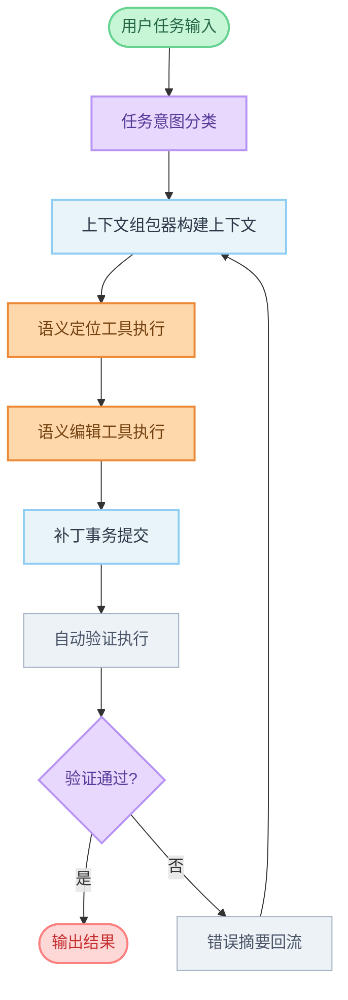

# FastClaw 代码能力开发方案

> **版本**: v1.0  
> **日期**: 2026-04-22  
> **状态**: Draft  
> **范围**: `fastclaw-agent` / `fastclaw-gateway` / `fastclaw-core`

---

## 1. 背景与目标

当前 FastClaw 已具备基础文件能力（`read_file`、`write_file`、`edit_file`、`apply_patch`、`search_in_files`），但与 Cursor / Codex 的“代码智能体”体验仍有差距，主要体现在：

- 语义定位能力不足（定义、引用、重命名依赖文本搜索）
- 上下文组织机制偏弱（缺少任务导向的自动组包）
- 改动后的验证闭环不完整（诊断、修复、复验自动化程度不够）

本方案目标是在保持现有架构稳定的前提下，分阶段引入语义工具链与上下文机制，构建“定位-修改-验证-回流”闭环。

---

## 2. 设计原则

- **优先兼容现有工具**：新增能力与现有文件工具互补，不破坏已上线调用路径。
- **渐进式落地**：先“可用”，再“好用”，最后“高性能”。
- **可回退**：语义工具不可用时自动降级到文本工具，不阻断任务。
- **可观测**：每个阶段都暴露耗时、命中率、失败率指标。
- **安全优先**：编辑动作默认 dry-run 或带乐观锁，避免误改。

---

## 3. 目标架构

### 3.1 能力分层

| 层级 | 目标 | 关键能力 |
|---|---|---|
| L0 文件层 | 可靠读写与补丁 | read, write, edit, apply_patch, search |
| L1 语义定位层 | 准确找到代码实体 | symbols, definition, references, hover |
| L2 语义编辑层 | 降低误改风险 | rename, code_action, workspace_edit |
| L3 验证闭环层 | 改动后自动复验 | diagnostics, test impact, run verification |
| L4 上下文编排层 | 降低提示词成本 | context assembler, 分层记忆, 预算裁剪 |

### 3.2 核心流程

1. 意图识别（修复 / 重构 / 新功能 / 测试）
2. 自动上下文组包（代码片段 + 诊断 + 历史变更）
3. 语义定位（symbols / definition / references）
4. 语义编辑（rename / code_action / patch）
5. 自动验证（lint / check / targeted test）
6. 错误摘要回流并二次修复

---

## 4. 工具清单与接口设计

## 4.1 L1 语义定位工具

### 4.1.1 `workspace_symbols`

- **用途**：按符号名检索全仓库符号
- **入参**：
  - `query: string`
  - `kinds?: string[]`
  - `limit?: number`
- **出参**：
  - `items: [{ name, kind, path, start_line, start_column, end_line, end_column }]`

### 4.1.2 `go_to_definition`

- **用途**：从使用点跳转定义
- **入参**：`path`, `line`, `column`
- **出参**：`locations: [{ path, line, column, end_line, end_column }]`

### 4.1.3 `find_references`

- **用途**：查找符号引用
- **入参**：`path`, `line`, `column`, `include_declaration?`
- **出参**：`references: [{ path, line, column, end_line, end_column }]`

### 4.1.4 `hover_info`（建议）

- **用途**：获取类型与文档信息
- **入参**：`path`, `line`, `column`
- **出参**：`markdown`, `type_hint`, `range`

## 4.2 L2 语义编辑工具

### 4.2.1 `rename_symbol`

- **用途**：跨文件安全重命名
- **入参**：`path`, `line`, `column`, `new_name`, `dry_run?`
- **出参**：
  - `summary: { file_count, edit_count }`
  - `workspace_edit`

### 4.2.2 `apply_workspace_edit`

- **用途**：应用语义编辑结果
- **入参**：`workspace_edit`, `expected_versions?`, `dry_run?`
- **出参**：`applied`, `conflicts`, `changed_files`

### 4.2.3 `code_action`

- **用途**：获取或应用 quick fix
- **入参**：`path`, `start_line`, `start_column`, `end_line`, `end_column`, `diagnostic_codes?`
- **出参**：`actions: [{ id, title, kind, workspace_edit }]`

## 4.3 L3 验证闭环工具

### 4.3.1 `read_diagnostics`

- **用途**：统一读取 LSP 与编译器诊断
- **入参**：`paths?`, `severity?`
- **出参**：`diagnostics: [{ path, line, column, code, source, message, severity }]`

### 4.3.2 `test_impact_analysis`

- **用途**：根据改动文件选择测试目标
- **入参**：`changed_files: string[]`
- **出参**：`test_targets: string[]`, `strategy`

### 4.3.3 `run_verification`

- **用途**：标准化验证入口
- **入参**：`scope`(`lint|check|test`), `targets?`, `timeout_sec?`
- **出参**：`success`, `duration_ms`, `summary`, `failures`

---

## 5. 上下文机制设计

## 5.1 Context Assembler

输入源：

- 用户当前请求
- 最近修改文件（git diff）
- 最新诊断信息
- 最近工具调用轨迹
- 会话中高相关历史片段

输出分层：

- **Tier A 必选**：用户显式提及文件 + 当前报错文件
- **Tier B 强相关**：语义定位工具返回的候选代码块
- **Tier C 补充**：历史摘要与约束信息

## 5.2 预算与裁剪策略

- 按 token 预算分配 Tier A/B/C
- 先发送符号摘要，再按需展开代码窗口
- 统一代码块锚点：`path + start_line + end_line + content_hash`

## 5.3 会话记忆分层

- **短期记忆**：当前任务步骤与失败原因
- **中期记忆**：本任务决策与取舍
- **长期记忆**：仓库约定与偏好（测试策略、命名、风格）

---

## 6. 分阶段实施计划

## 6.1 Phase 1（语义定位 MVP，1-2 周）

交付：

- `workspace_symbols`
- `go_to_definition`
- `find_references`
- `read_diagnostics`（基础版）
- Context Assembler v1（规则驱动）

验收：

- 常见语言下定义跳转成功率 > 85%
- 首次定位相关代码 P95 < 2.5s

## 6.2 Phase 2（语义编辑，1-2 周）

交付：

- `rename_symbol`（dry-run 默认）
- `apply_workspace_edit`
- `code_action`
- `run_verification`（lint/check）

验收：

- 跨文件重命名正确率 > 95%
- 编辑冲突可检测并返回明确冲突点

## 6.3 Phase 3（验证闭环与性能，1 周）

交付：

- `test_impact_analysis`
- `run_verification`（test）
- Context Assembler v2（预算裁剪 + 命中缓存）

验收：

- 平均回合耗时下降 20%+
- 回归失败定位耗时下降 30%+

---

## 7. 数据结构建议

```ts
type CodeAnchor = {
  path: string
  startLine: number
  endLine: number
  hash: string
}

type ContextBundle = {
  taskIntent: "bugfix" | "refactor" | "feature" | "test"
  mustInclude: CodeAnchor[]
  relevant: CodeAnchor[]
  diagnostics: Array<{
    path: string
    line: number
    column: number
    message: string
    code?: string
    severity: "error" | "warning" | "info"
  }>
  constraints: string[]
}
```

---

## 8. 指标与可观测性

- `code_tool_latency_ms{tool_name}`
- `semantic_lookup_hit_rate`
- `context_bundle_token_count`
- `verification_pass_rate`
- `repair_loop_iterations`

日志字段建议：

- `task_intent`
- `tool_path`（语义工具链执行轨迹）
- `fallback_used`（是否降级到文本工具）
- `failure_stage`（定位 / 编辑 / 验证）

---

## 9. 风险与应对

| 风险 | 影响 | 缓解方案 |
|---|---|---|
| LSP 不稳定或无响应 | 语义能力不可用 | 自动降级到 `search_in_files + read_file` |
| 大仓库检索慢 | 交互延迟高 | 增量索引 + 目录忽略 + 分页 |
| 误改跨文件内容 | 高风险回归 | dry-run 默认 + 乐观锁 + 冲突检测 |
| 验证耗时不可控 | 回合时间过长 | 先 lint/check，测试走影响分析 |

---

## 10. 里程碑与产出物

| 里程碑 | 时间 | 产出 |
|---|---|---|
| M1 | Week 1 | 语义定位工具 + Assembler v1 |
| M2 | Week 2-3 | 语义编辑工具 + workspace_edit 流程 |
| M3 | Week 4 | 验证闭环 + 影响测试 + 指标看板 |

最终产出：

- 新工具实现代码
- 工具 schema 文档
- E2E 测试用例
- 运行手册与回退手册

---

## 11. 附录：MVP 开发顺序（建议）

1. 先做 `go_to_definition` 与 `find_references`
2. 再做 `workspace_symbols`
3. 接入 `read_diagnostics`
4. 落地 `rename_symbol`（dry-run）
5. 实现 `apply_workspace_edit`
6. 实现 `run_verification`
7. 最后补 `test_impact_analysis` 与缓存

---

## 流程图解


