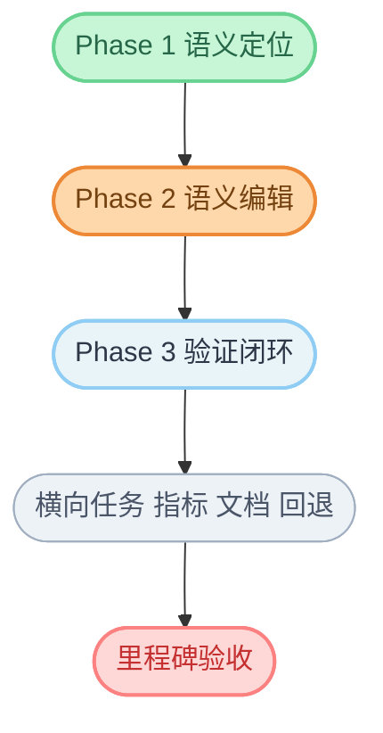

# 代码能力建设任务拆解（Issue 清单）

> 对应方案：`docs/design/code-capability-development-plan.md`  
> 目标：将方案拆解为可直接执行的研发任务与验收标准

---

## 0. 排期建议

- **Sprint 1**：语义定位 + 诊断聚合（Phase 1）
- **Sprint 2**：语义编辑 + 工作区补丁（Phase 2）
- **Sprint 3**：验证闭环 + 上下文优化（Phase 3）

---

## 1. Phase 1 任务（语义定位 MVP）

## 1.1 TASK-P1-001 接入语言服务会话管理器

- **优先级**：P0
- **目标**：建立可复用的 LSP 会话池，支持多语言按 workspace 复用连接
- **主要改动**：
  - 新增 `crates/fastclaw-agent/src/code/lsp_manager.rs`
  - 在运行时注入会话管理依赖
- **验收标准**：
  - 可按 `workspace + language` 获取会话
  - 会话异常可自动重连
  - 单测覆盖：创建、复用、异常恢复
- **依赖**：无

## 1.2 TASK-P1-002 实现 `workspace_symbols` 工具

- **优先级**：P0
- **目标**：支持全仓符号检索
- **主要改动**：
  - 新增 `WorkspaceSymbolsTool`
  - 工具注册到 `builtin_tools/mod.rs`
- **验收标准**：
  - 返回结构化符号列表
  - `limit` 生效
  - 无服务时自动降级并给出明确错误信息
- **依赖**：TASK-P1-001

## 1.3 TASK-P1-003 实现 `go_to_definition` 工具

- **优先级**：P0
- **目标**：从引用点定位定义
- **主要改动**：
  - 新增 `GoToDefinitionTool`
- **验收标准**：
  - 至少支持 Rust/TS 两种语言
  - 多定义场景返回列表
  - 无结果场景返回空列表而非异常
- **依赖**：TASK-P1-001

## 1.4 TASK-P1-004 实现 `find_references` 工具

- **优先级**：P0
- **目标**：定位符号所有引用
- **主要改动**：
  - 新增 `FindReferencesTool`
- **验收标准**：
  - `include_declaration` 参数生效
  - 结果去重稳定
  - 大结果集支持 `max_results` 截断
- **依赖**：TASK-P1-001

## 1.5 TASK-P1-005 实现 `read_diagnostics` 基础版

- **优先级**：P1
- **目标**：统一读取 LSP 诊断并标准化输出
- **主要改动**：
  - 新增 `ReadDiagnosticsTool`
- **验收标准**：
  - 支持按路径过滤
  - severity 过滤生效
  - 输出字段统一（path/line/column/code/source/message/severity）
- **依赖**：TASK-P1-001

## 1.6 TASK-P1-006 Context Assembler v1（规则驱动）

- **优先级**：P0
- **目标**：自动组合当前任务上下文
- **主要改动**：
  - 新增 `context/assembler.rs`
  - 接入运行时消息构建链路
- **验收标准**：
  - 必选包含：用户显式文件 + 诊断文件
  - 预算超限时优先保留 Tier A
  - 输出结构稳定可观测
- **依赖**：TASK-P1-002~005

---

## 2. Phase 2 任务（语义编辑）

## 2.1 TASK-P2-001 实现 `rename_symbol`（默认 dry-run）

- **优先级**：P0
- **目标**：跨文件语义重命名
- **主要改动**：
  - 新增 `RenameSymbolTool`
- **验收标准**：
  - `dry_run=true` 返回 workspace_edit 预览
  - 非 dry-run 支持版本冲突检测
  - 冲突返回冲突文件与原因
- **依赖**：Phase 1 完成

## 2.2 TASK-P2-002 实现 `apply_workspace_edit`

- **优先级**：P0
- **目标**：统一应用语义编辑补丁
- **主要改动**：
  - 新增 `ApplyWorkspaceEditTool`
  - 桥接至现有 `apply_patch` / `write_file`
- **验收标准**：
  - 支持多文件原子语义提交（逻辑层）
  - 失败时返回可重试建议
- **依赖**：TASK-P2-001

## 2.3 TASK-P2-003 实现 `code_action`

- **优先级**：P1
- **目标**：获取 quick fix 并可应用
- **主要改动**：
  - 新增 `CodeActionTool`
- **验收标准**：
  - 可按诊断 code 过滤
  - 返回 action 的结构化信息
  - 应用后可触发验证链路
- **依赖**：Phase 1 + TASK-P2-002

## 2.4 TASK-P2-004 编辑安全策略

- **优先级**：P0
- **目标**：语义编辑全过程启用保护机制
- **主要改动**：
  - 统一乐观锁策略
  - 统一 dry-run 选项
  - 增加“高风险变更确认”标识字段
- **验收标准**：
  - 所有编辑类工具均支持 `dry_run`
  - 冲突率/失败率有指标输出
- **依赖**：TASK-P2-001~003

---

## 3. Phase 3 任务（验证闭环与性能）

## 3.1 TASK-P3-001 实现 `run_verification`

- **优先级**：P0
- **目标**：统一 lint/check/test 执行入口
- **主要改动**：
  - 新增 `verification/runner.rs`
  - 工具层新增 `RunVerificationTool`
- **验收标准**：
  - 支持 scope 切换
  - 返回标准化失败摘要
  - 超时与中断可控
- **依赖**：Phase 2 完成

## 3.2 TASK-P3-002 实现 `test_impact_analysis`

- **优先级**：P1
- **目标**：按变更文件选择受影响测试
- **主要改动**：
  - 新增 `verification/test_impact.rs`
- **验收标准**：
  - 能输出测试目标列表
  - 无映射时有降级策略（最小回归集）
- **依赖**：TASK-P3-001

## 3.3 TASK-P3-003 Context Assembler v2（预算 + 缓存）

- **优先级**：P0
- **目标**：降低上下文构建耗时与 token 成本
- **主要改动**：
  - 增加缓存层（符号查询、诊断快照）
  - 增加预算裁剪策略
- **验收标准**：
  - 组包耗时 P95 改善 > 20%
  - 上下文 token 成本可观测
- **依赖**：TASK-P1-006

## 3.4 TASK-P3-004 端到端回归测试集

- **优先级**：P0
- **目标**：形成“定位-编辑-验证”完整回归场景
- **主要改动**：
  - 新增 E2E 测试文件
  - 覆盖语义工具不可用降级路径
- **验收标准**：
  - E2E 场景 >= 8 条
  - 覆盖成功路径与失败回流路径
- **依赖**：Phase 3 其余任务

---

## 4. 横向任务（贯穿三期）

## 4.1 TASK-X-001 指标与日志补齐

- `code_tool_latency_ms`
- `semantic_lookup_hit_rate`
- `context_bundle_token_count`
- `verification_pass_rate`
- `repair_loop_iterations`

## 4.2 TASK-X-002 文档与示例更新

- 更新 `docs/tools/index.md`（已完成基础版）
- 新增语义工具调用示例
- 增加故障排查章节

## 4.3 TASK-X-003 回退与开关机制

- 语义工具全局开关
- 单工具开关
- 自动降级路径开关

---

## 5. 里程碑验收清单

- **M1 验收**：语义定位链路可用，Context Assembler v1 稳定
- **M2 验收**：语义编辑链路可用，跨文件重命名可控
- **M3 验收**：验证闭环与测试影响分析上线，核心指标达标

---

## 6. 建议 Issue 标签体系

- `area/code-tools`
- `area/context-assembler`
- `area/verification`
- `kind/feature`
- `kind/refactor`
- `priority/p0`
- `priority/p1`

---

## 流程图解

