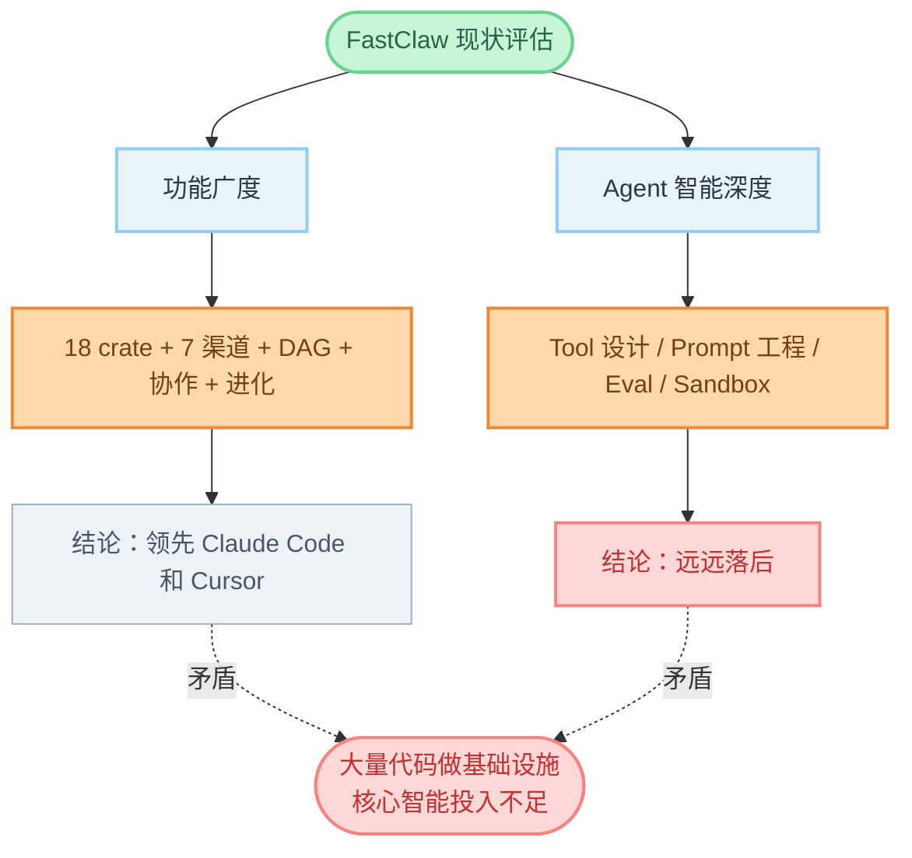
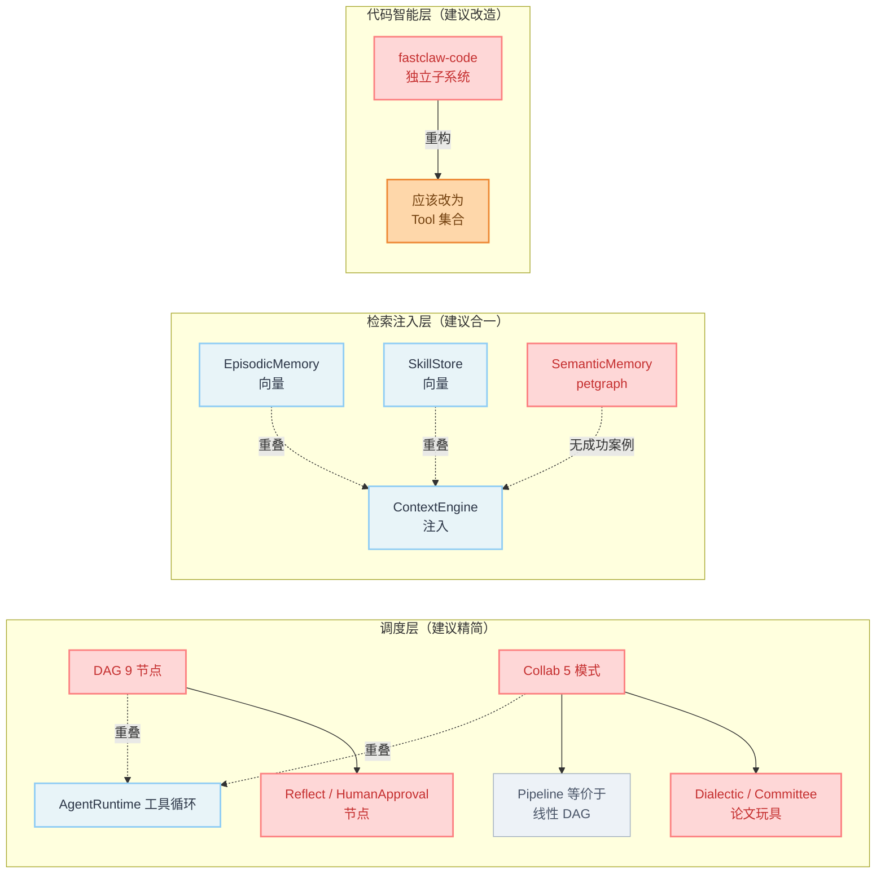
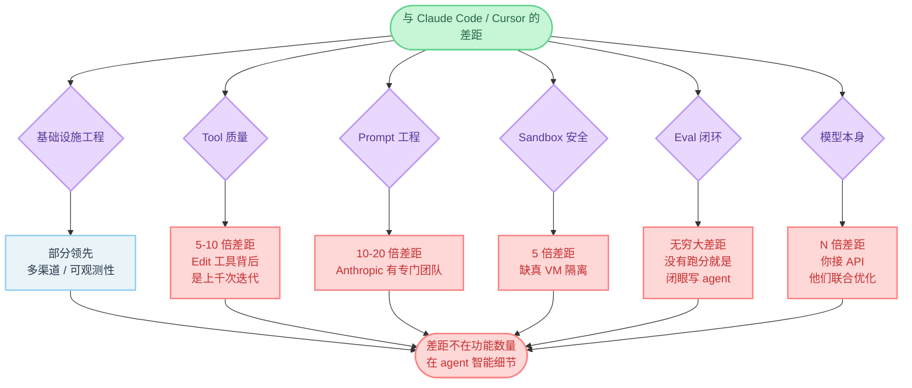
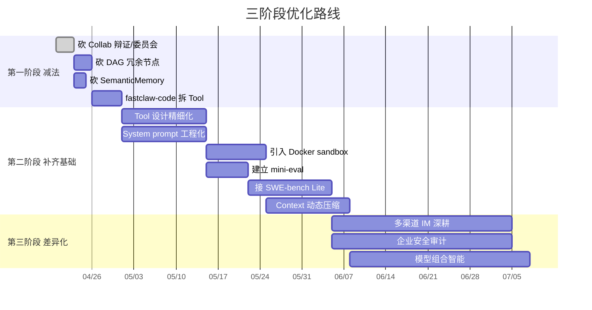
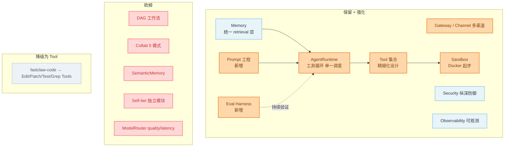

# FastClaw 架构评估与优化路线

> 评估日期：2026-04-20  
> 对标对象：Claude Code、Cursor Composer、OpenAI Codex CLI、Aider、Cline  
> 评估范围：[`fastclaw.md`](./fastclaw.md) v0.1.0 架构设计文档

---

## 总体判断（一句话）

> **FastClaw 是一个工程量惊人、但 agent 含量很低的设计**——绝大多数代码在做基础设施，几乎没有触及 agent 智能的核心。架构图里"那些没出现的东西"，恰恰是 agent 质量的护城河。

---

## 目录

- [一、冗余诊断](#一冗余诊断)
- [二、是否单薄：换个角度看，非常单薄](#二是否单薄换个角度看非常单薄)
- [三、与 Claude Code / Cursor 的差距量化](#三与-claude-code--cursor-的差距量化)
- [四、三阶段优化路线](#四三阶段优化路线)
- [五、灵魂问题](#五灵魂问题)
- [六、附：关键决策清单](#六附关键决策清单)
- [可视化图表](#可视化图表)

---

## 一、冗余诊断

> 核心判断标准：**同一件事是否有多套机制在做？这件事在 prod 里有人用吗？**

至少有 **5 处明显的过度工程**，按严重程度排序：

### 1.1 三套调度引擎，职责高度重叠（最严重）

| 子系统 | 调度能力 | 实际用途 |
|---|---|---|
| `AgentRuntime` 工具循环 | LLM ↔ Tool 反复迭代 | 99% 的请求 |
| `fastclaw-dag` 9 种节点 | 显式有向图编排 | 复杂确定性工作流 |
| `fastclaw-collab` 5 种模式 | Pipeline / Dialectic / Committee / ... | 多 agent 协作 |

**问题**：
- **Pipeline 模式 = 线性 DAG**，是 DAG 的子集
- **Dialectic / Committee** 完全可以用 DAG 的 `Parallel + Join + LLM` 表达
- **DAG 里的 `LLM` 节点 + `Tool` 节点** 做的事和 `AgentRuntime` 一模一样
- **`Reflect` / `Loop` 节点** 让 LLM 做的事，本来就是 LLM 自己 reasoning 该做的

**业界对比**：Claude Code、Cursor Agent、Codex CLI **都没有 DAG**。它们的哲学是——**调度交给 LLM**，工程层只提供工具。Devin 有 plan，但 plan 也是 LLM 生成的自然语言，不是图。

**引入 DAG 的真实代价**：维护成本、debug 难度、用户学习成本。换来的好处是确定性——但对 agent 来说，"确定性"本身就是个伪需求，因为 LLM 输出本来就不确定。

### 1.2 检索-注入链路有四个轮子

| 模块 | 做的事 |
|---|---|
| `EpisodicMemory` | 向量检索历史事件 |
| `SkillStore` | 向量检索可复用技能 |
| `ContextEngine` | 检索后注入上下文 |
| `SemanticMemory` (`petgraph`) | 图遍历查关联 |

四套数据结构、四套检索逻辑、四套生命周期，最终都是为了往 system prompt 里塞东西。**业界做法是一个 retrieval 层 + 多个 source**，统一打分排序。

`SemanticMemory` 用 petgraph 存 Fact + Relationship 这种设计，**在生产 agent 里几乎没有成功案例**。MemGPT、Letta 都试过类似方向，效果不如 RAG + 长上下文。

### 1.3 5 种模型路由策略 + 6 层上下文预算 = 配置黑洞

- `fixed / cost / quality / latency / fallback` 听起来漂亮，但 **`quality` 和 `latency` 在生产里没法量化**——你怎么知道 GPT-4 比 Claude 在这个 prompt 上"质量更高"？
- 6 层预算（System / Skills / Memory / History / Context / User）是静态切分。**真正聪明的做法是动态预算**（importance-based eviction），见 Claude 的 auto-compact

### 1.4 `fastclaw-code` 是一个迷茫的子系统

包含：Tree-sitter Index、CodeGraph、TestRunner、PatchEngine、Refactor、AutoFix、Sandbox。

**问题**：这些应该是 **Agent 的工具**，而不是独立子系统。
- `PatchEngine` 应该是一个 Tool（类似 Claude 的 `Edit`）
- `TestRunner` 应该是一个 Tool（类似 `Bash` 的特化）
- `CodeGraph` 应该是一个 Tool（类似 `Grep + Glob` 的语义版本）

把它们设计成独立 crate，反而**让 LLM 用不上**——因为 LLM 只能调用 Tool。这暴露了一个深层问题：**架构师在用"传统软件思维"而非"agent 思维"在设计**。

### 1.5 5 种 Collab 模式，至少 3 种是论文产物

| 模式 | 生产价值 | 处置 |
|---|---|---|
| Delegation (subagent) | 有价值，Claude Code/Cursor 都在用 | **保留** |
| Pipeline | 有价值，但等价于 DAG | 合并到 DAG |
| Dialectic（辩证） | 没人用，质量提升有限 + 成本翻倍 | **砍掉** |
| Committee（委员会） | 没人用，本质是 ensemble，prod 里没收益 | **砍掉** |
| CollabHub（能力注册） | 设计漂亮，但和 ToolRegistry 职责重叠 | 合并 |

---

## 二、是否单薄：换个角度看，非常单薄

### 2.1 "单薄"的真实含义

文档展示了 **18 个 crate + 7 个渠道扩展 + 9 种节点 + 5 种策略 + 5 种协作 + 3 层记忆**——从**功能广度**看一点不薄。

但 agent 的智能不在功能广度，**在以下七个细节**：

| 维度 | FastClaw 现状 | Claude Code / Cursor 现状 |
|---|---|---|
| **Tool 设计哲学** | 只有 Tool trait 接口 | Tool 设计是核心竞争力（Edit / MultiEdit / Read 的细节决定上限） |
| **System prompt 工程** | 文档零提及 | 数千行精心打磨的 prompt + 角色定义 |
| **错误恢复智能** | `SelfIterEngine` "注入诊断" | LLM 自主诊断 + 主动 propose 替代方案 |
| **上下文压缩** | "滚动压缩"一笔带过 | Auto-compact、importance-based、tool result truncation |
| **Sandbox 严肃性** | "Shell 禁用 + 大小限制" | Docker / Firecracker / seccomp / 网络隔离 |
| **可评估性** | 448 个单元测试 | SWE-bench / Aider-bench / 内部 eval set 持续跑分 |
| **UX / Streaming 语义** | SSE 文本流 | 结构化事件（thinking / tool_call / result / edit_diff），todos，transcripts |

**关键判断**：架构图里**那些没出现的东西**，恰恰是 agent 质量的护城河。

### 2.2 一个直白的对比

Claude Code 的核心代码估计**不到 1 万行**（不含 SDK），它的强在：
- **十几个 Tool 的设计精度**——每个 Tool 的 description 都是几百字精雕细琢
- **system prompt 的工程**——明确的 role、behavior、anti-pattern
- **背后 Sonnet 4.5 模型本身的能力**

FastClaw 的 18 个 crate **可能有 5-10 万行 Rust 代码**，但如果接的是同一个 Claude API，**输出质量大概率不如 Claude Code**。

为什么？因为：
1. Claude Code 的 prompt 是 Anthropic 用了大量内部数据反复迭代的
2. Claude Code 的 Tool 定义是模型 fine-tune 时见过的形态
3. FastClaw 的"Edit 工具"如果只是简单的字符串替换，LLM 用起来错误率会高很多倍

---

## 三、与 Claude Code / Cursor 的差距量化

| 维度 | 差距 | 说明 |
|---|---|---|
| **基础设施工程** | -10% ~ +20% | 部分领先，比如多渠道、可观测性 |
| **Tool 质量** | **5-10 倍差距** | Claude 的 Edit 工具迭代了上千次 |
| **Prompt 质量** | **10-20 倍差距** | 你没有工程化 prompt，Anthropic 有专门团队 |
| **Sandbox 安全** | **5 倍差距** | 你只有进程内限制，他们有真 VM |
| **Eval 闭环** | **无穷大差距** | 你没有跑分，他们有 SWE-bench 50%+ 的硬数据 |
| **模型本身** | **N 倍差距** | 你接 API，他们和模型联合优化 |

**结论**：**差距主要不在"功能数量"，在"agent 智能细节"**。

---

## 四、三阶段优化路线

### 4.1 第一阶段：减法（1-2 周）

**目标**：砍掉 30% 功能，让架构瘦身。

```
减法清单：
[ ] 砍掉 fastclaw-collab 的 Dialectic / Committee 模式
[ ] 砍掉 fastclaw-dag 的 Reflect / HumanApproval / Code 节点
[ ] 砍掉 SemanticMemory（petgraph）
[ ] 砍掉 ModelRouter 的 quality / latency 策略
[ ] 把 fastclaw-code 拆成 Tools，不再独立子系统
[ ] 评估是否真的需要 7 个 IM 渠道（feishu 留着，其他按需）
```

**判断标准**：每个被删的功能，能找出**现在每周被调用 100 次以上**的真实场景吗？没有就砍。

### 4.2 第二阶段：补齐 agent 质量的核心短板（1-2 月）

#### 4.2.1 补 Tool 设计

学习 Claude Code 的 `Edit / MultiEdit / Read / Grep` 的设计：

```rust
// 现在的 Tool trait 只是骨架
trait Tool { fn execute(...) -> ... }

// 真正缺的是 Tool 的"内容"：
// - description 是 prompt engineering 的产物
// - parameter schema 要让 LLM 易读
// - error message 要对 LLM 友好（让它知道下一步怎么做）
// - result 要有结构化字段 + 给 LLM 看的简化版本
```

**具体动作**：
- 研究 [Claude Code 的 tool 定义](https://docs.anthropic.com/en/docs/build-with-claude/tool-use)
- 研究 Aider 的 [edit format](https://aider.chat/docs/more/edit-formats.html)
- 把每个核心 Tool 的 description / examples / error path 都写成几百字
- 优先级：`Edit` > `Read` > `Bash/Shell` > `Grep` > `Glob` > `Task (subagent)`

#### 4.2.2 补 Prompt 工程

建一个 `prompts/` 目录，每个 Agent 角色一个 markdown 文件，包含：
- Role / Identity
- Capabilities
- Anti-patterns（重要！）
- Tool usage examples
- Output format requirements

**参考来源**：
- Cursor 的 system_prompt（社区有泄露版本）
- [Cline](https://github.com/cline/cline) 的 prompt 库
- Aider 的 prompt 模板
- Claude Code 透露的 system prompt 结构

#### 4.2.3 补 Sandbox

抛弃"Shell 禁用"这种半吊子方案，引入：
- **Docker exec** 做工具沙箱（成本可控，推荐起步）
- **Firecracker microVM**（追求更强隔离时）
- 至少 **bubblewrap / nsjail** Linux 命名空间隔离

#### 4.2.4 补 Eval（最关键）

在 `crates/fastclaw-eval/` 里建立：
- **自定义 mini-eval**：10-50 个真实任务，覆盖代码编辑 / 调试 / 重构 / 文档生成
- **接 SWE-bench Lite**：[https://www.swebench.com/](https://www.swebench.com/)
- **每次架构改动都跑一遍**

> **没有 eval 就是在闭眼写 agent**。

#### 4.2.5 补 Context 管理

把"6 层静态预算"改成：
- **Importance-based eviction**：每条消息打分，低分先删
- **Auto-compact**：上下文超 X% 时自动摘要旧 turn
- **Tool result truncation**：长输出自动截断 + "已截断 N 行"提示
- **System reminder 注入**：模仿 Claude 的 `<system-reminder>` 机制

### 4.3 第三阶段：差异化（3-6 月）

砍完冗余、补齐基础后，思考你**真正的差异化**在哪。可能的方向：

| 方向 | 优势 | 风险 |
|---|---|---|
| **多渠道 IM 接入** | FastClaw 现在**唯一明显领先**的地方。Claude Code 没有，Cursor 没有，Codex 没有 | 要持续维护 7 个平台 SDK，工作量大 |
| **企业级安全 / 审计** | Rust + HMAC + SSRF 防御这套基础设施，瞄准 To-B 场景 | To-B 销售周期长，竞品多（Glean、Sana 等） |
| **模型组合智能** | 不同任务用不同模型 + prompt 套餐（reasoning 用 o1、editing 用 Claude、search 用 GPT-4o） | 需要大量 eval 才能调对路由规则 |

---

## 五、灵魂问题

> **如果今天你拿 FastClaw 和 Claude Code 跑同一个真实任务（比如 "在这个 repo 里实现 OAuth 登录"），结果会怎样？**

如果答案是"不知道"或"大概率打不过"，那架构再漂亮都是**自嗨**。

**建议第一周就做一件事**：搭一个最小评测，用 FastClaw 跑 10 个真实任务，记录成功率和失败模式。这个数据会比所有架构讨论都有用。

---

## 六、附：关键决策清单

### 6.1 立刻可以做的决策（不需要更多信息）

```
[ ] 砍掉 Dialectic / Committee 协作模式
[ ] 砍掉 SemanticMemory
[ ] 砍掉 ModelRouter 的 quality / latency 策略
[ ] 把 PatchEngine / TestRunner / CodeGraph 重构为 Tool
```

### 6.2 需要先看数据再决定

```
[ ] 7 个 IM 渠道留几个？→ 看每个渠道的实际活跃用户数
[ ] DAG 系统是否完全砍掉？→ 看现有 DAG 工作流被调用的频率
[ ] CollabHub 是否合并到 ToolRegistry？→ 看 Hub 现在管理的能力数
```

### 6.3 需要重大投入的方向

```
[ ] 建立 eval harness（mini-eval + SWE-bench Lite 接入）
[ ] 重做核心 Tool 设计（Edit / Read / Bash 等）
[ ] System prompt 工程化体系
[ ] Docker-based sandbox
```

---

## 可视化图表

### 现状矛盾



### 冗余地图



### 差距分析



### 优化路线时间表



### 建议的目标架构



---

## 一句话收尾

> **砍掉 30%、补齐基础设施之外的 7 个智能细节、跑起来 eval——这三件事做完，FastClaw 才有资格谈"对标 Claude Code"。**
