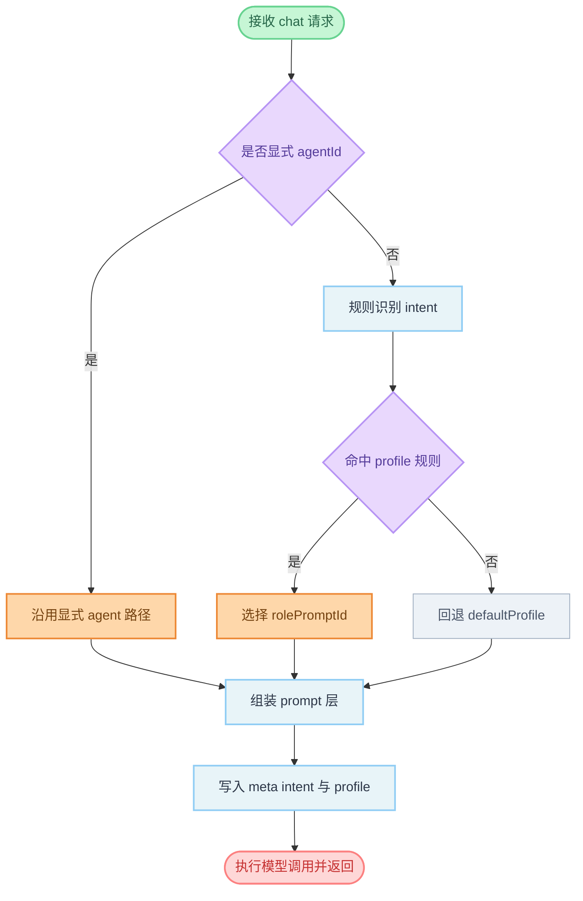

# 意图识别与动态提示词路由技术方案

## 背景与问题定义

当前 `main` agent 在 WebUI/API 聊天路径下的角色提示词相对固定，难以在编码、代码审查、文档整理等任务间自动切换最佳提示词风格。  
虽然系统已经具备多角色 prompt 资产（如 `prompts/agents/code-assistant.md`、`prompts/agents/code-reviewer.md`），但缺少一层稳定的意图识别与动态路由机制。

已观察到的典型问题：

- 同一 `main` agent 面对不同类型任务时，行为风格不够专注。
- 用户不显式切换 agent 时，无法自动使用更合适的角色提示词。
- 运行时上下文（state 目录、agent 默认 workspace）对模型不透明，导致目录认知偏差。

## 目标

1. 在不破坏现有 `agentId` 显式指定语义的前提下，新增“意图识别 -> prompt profile 路由”能力。
2. 对 WebUI/API 聊天链路生效，保证与 channel 路径行为一致性。
3. 提供可观测元数据，便于定位误判与回归问题。
4. 支持灰度与快速回滚。

## 非目标

- 本阶段不替代现有 agent 路由（bindings/agentId）。
- 本阶段不做跨会话长时意图记忆。
- 本阶段不在核心链路引入高延迟依赖（例如每次都调用外部分类模型）。

## 总体设计

### 核心思路

在 `chat_pipeline` 的 `setup_chat` 阶段新增 `Prompt Router`：

1. 先看用户是否显式给了 `agentId`，若是则按现有逻辑执行。
2. 否则读取最近用户输入，执行意图识别（MVP 先规则）。
3. 根据识别出的 profile 选择角色提示词层（如 `code-assistant`）。
4. 与基础层、技能层、运行时路径层合并，生成最终系统提示词上下文。
5. 在响应 `_meta` 中暴露 intent/profile，便于诊断。

### Prompt 组装顺序

建议顺序（从低优先到高优先）：

1. `system-base.md`
2. `tool-usage-guide.md`
3. `agents/<rolePromptId>.md`（由 profile 决定）
4. skills prompt（按 `skills.promptMode`）
5. runtime paths prompt（state/workspace/cwd 与使用约束）
6. 用户与上下文消息

## 配置模型设计

在主配置新增 `promptRouter`：

```json
{
  "promptRouter": {
    "enabled": true,
    "defaultProfile": "default",
    "profiles": {
      "default": { "rolePromptId": "main" },
      "coding": { "rolePromptId": "code-assistant" },
      "review": { "rolePromptId": "code-reviewer" },
      "docs": { "rolePromptId": "writing" }
    },
    "rules": [
      { "profile": "coding", "keywords": ["写代码", "实现", "修复", "重构", "函数"] },
      { "profile": "review", "keywords": ["review", "代码审查", "风险", "回归"] },
      { "profile": "docs", "keywords": ["文档", "README", "注释", "设计说明"] }
    ]
  }
}
```

字段说明：

- `enabled`: 总开关，关闭后完全回退现有行为。
- `defaultProfile`: 未命中规则时的默认 profile。
- `profiles`: profile 到角色提示词 ID 的映射。
- `rules`: 规则列表，按顺序匹配，命中即返回（可扩展优先级字段）。

## 运行时决策规则

优先级建议：

1. 显式 `request.agent_id`（最高优先）
2. 显式 `request.model` 且为已有 agent id（沿用现有 BUG-003 兼容逻辑）
3. `promptRouter` 规则命中 profile
4. `defaultProfile`

冲突策略：

- 同时命中多个规则：按声明顺序或 `priority` 字段取最高。
- 低置信规则（未来 Hybrid 模式）：回退 `defaultProfile`，避免激进误路由。

## 可观测性设计

响应 `_meta` 新增：

- `intent`: 识别到的意图标签（如 `coding`）
- `promptProfile`: 最终生效 profile（如 `coding`）
- `promptRouteReason`: `explicit-agent` / `rule-hit` / `default-fallback`

日志建议：

- `prompt_router_decision`（profile、reason、matched_rule）
- `prompt_router_disabled`（配置关闭时）
- `prompt_router_fallback`（规则未命中）

## 安全与边界约束

- 不改变工具权限边界；工具可用性仍由 `toolsAllow/toolsDeny` 与注册策略控制。
- 即使识别为 coding，也不能绕过 destructive 操作确认机制。
- runtime path prompt 明确声明：默认以 agent workspace 为主，不将进程 cwd 视作业务工作目录。

## 性能与稳定性

- MVP 规则识别为 O(n*m) 字符串匹配，延迟可忽略。
- profile 解析失败时必须无害回退 `defaultProfile`。
- profile 对应 role prompt 缺失时回退 `main` 并记录 warning。

## 分阶段实施计划

### M1（本期）

- 规则识别版 prompt router
- 配置结构与开关
- `_meta` 透出与日志
- 回归测试覆盖

### M2（后续）

- Hybrid 分类（规则 + 小模型兜底）
- 置信度阈值与观测看板
- 规则热更新与在线评估

## 代码改动清单（建议）

- `crates/fastclaw-core/src/config.rs`
  - 新增 `PromptRouterConfig`、`PromptProfileConfig`、`PromptRuleConfig`
- `crates/fastclaw-core/src/workspace.rs`
  - 增加按 `rolePromptId` 读取角色 prompt 的函数
- `crates/fastclaw-gateway/src/chat_pipeline.rs`
  - 接入 `resolve_intent_profile` 与动态 role prompt 注入
- `crates/fastclaw-gateway/src/routes/chat.rs`
  - `_meta` 扩展 intent/profile 字段
- `config/default.json` 与 schema
  - 新增 `promptRouter` 示例和校验
- `docs/`
  - 更新配置文档与行为说明

## 测试计划

### 功能测试

- 输入“请实现一个 Rust 函数” -> `intent=coding`
- 输入“请做代码审查” -> `intent=review`
- 输入“帮我润色 README” -> `intent=docs`
- 常规闲聊 -> `intent=default`

### 兼容测试

- 显式 `agentId` 时不触发动态路由覆盖
- `promptRouter.enabled=false` 时行为与当前版本一致
- profile 指向不存在 role prompt 时安全回退

### 回归测试

- skills 注入仍生效
- runtime path prompt 仍生效
- 工具注册与调用路径不回归

## 回滚策略

- 配置级回滚：`promptRouter.enabled=false`
- 代码级回滚：保留旧路径分支，支持快速 feature flag 回切

---

## 流程图解


